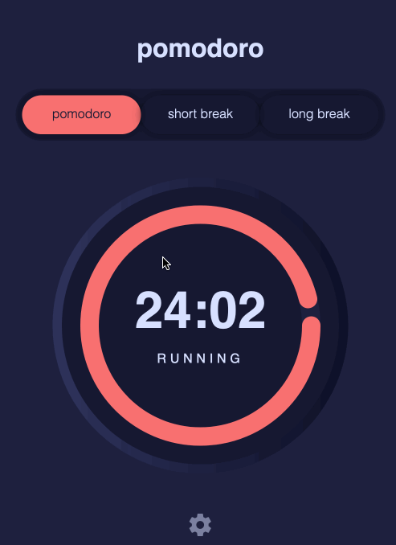

# Pomodoro Time management App

## Table of contents

  - [Feature](#feature)
  - [Screenshot](#screenshot)
  - [Built with](#built-with)
  - [Continued development](#continued-development)
  - [Author](#author)

### Feature 

Users should be able to:

- View the optimal layout for the site depending on their device's screen size
- See active/selected states for all interactive elements on the page
- set timer parameters such as pomodoros and break lengths
- start and stop the timer
- change skin color and fonts

### Screenshot

### Links

- Solution URL: [Add solution URL here](https://github.com/DanielTeshager/Pomodoro)
- Live Site URL: [Add live site URL here](https://6268db3086756d5d98c385d5--cozy-crostata-99c3a6.netlify.app/)
### Built with
- HTML
- CSS custom properties
- Flexbox
- CSS Grid
- Mobile-first workflow
- JavaScript

### Continued development
I'll be working on this project in the future. Improving code qualit, UI and add more features are the main priorities.

## Author

- Twitter - [@danteshager](https://www.twitter.com/danteshager)

